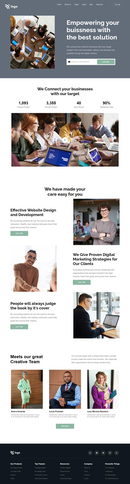

# Business Landing Page

Hi 👋 I am Shobhan Sundar Goutam. This project is made with the help of `HTML` and `CSS`.

 

- ### Learnings from this project:-

  - Learned to use CSS Positions more precisely while creating the play button with circles.
  - Learned a very good way of wrapping `absolute` elements under `relative` parents so that their positions remain intact in different screens.
  - Learned to use other css properties for creating responsivenss of the website.

- It took around _13 hours_ to complete.

- Live Link:- [Business Landing Page](https://businesslanding-fsjs12.netlify.app/)

### Screenshot

